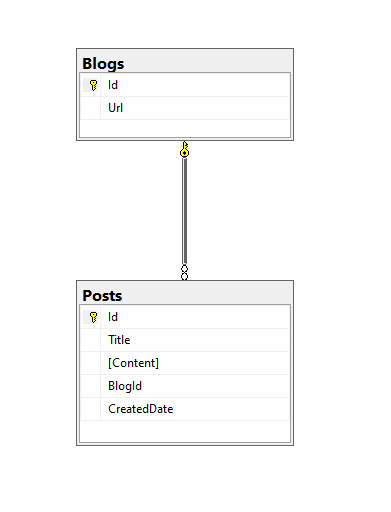

# Author
 - Todor Dimitrov
 
# Project description
 - TransactionPerRequest is example project of wrapping http request on the server in one transaction

 - The solution consists of a 3 projects
	 - TransactionPerRequest.Api - Simple web application with 3 routes
	    - POST route for request without error - successfully insert record in the database and transaction is committed
	    http://localhost:5001​/Blog​/CreateBlogsWithoutError
	    - POST route for request with error - fail to insert record in the database and transaction is rollback
	    http://localhost:5001​/Blog​/CreateBlogsWithError
	    - GET route to get all records in the database - 
	    http://localhost:5001​/Blog​
	 - TransactionPerRequest.Data
		- Simple data layer without abstractions and repositories just for the example
	 - TransactionPerRequest.Migration - Database migrator to run migrations automatically without transaction per request

# Software Dependencies
 - [Docker](https://www.docker.com/get-started/)

# Run the project
	1. docker-compose build
	2. docker-compose up
 
navigate to http://localhost:5001/swagger/index.html
# Resources
- [.NET 6](https://dotnet.microsoft.com/en-us/download/dotnet/6.0)
- [ASP.NET Core](https://github.com/dotnet/aspnetcore)
- [Entity Framework Core](https://docs.microsoft.com/en-us/ef/core/)
- [Microsoft SQL Server](https://www.microsoft.com/en-us/sql-server/sql-server-downloads)
- [Swagger](https://swagger.io/)
	
# More Info

#### Shoping System - helps other people to get their essentials

 - Bounded contexts - Shoping Request, Published Shoping Request and Execution of the Request

## Database Diagram

&nbsp;
&nbsp;
&nbsp;
### Transaction filter
	- It is executes on every request. If there is exception the transaction is rollback

``` cs
    public class TransactionFilter : IAsyncActionFilter
    {
        private readonly IDbTransaction transaction;

        public TransactionFilter(IDbTransaction transaction)
        {
            this.transaction = transaction;
        }

        public async Task OnActionExecutionAsync(ActionExecutingContext context, ActionExecutionDelegate next)
        {
            var connection = transaction.Connection;
            if (connection == null || connection.State != ConnectionState.Open)
            {
                throw new NotSupportedException("Connection was not open");
            }

            ActionExecutedContext executedContext = await next.Invoke();
            if (executedContext.Exception == null)
            {
                transaction.Commit();
            }
            else
            {
                transaction.Rollback();
            }
        }
    }

```
&nbsp;
&nbsp;
### DbContext registration
  
```cs
    public static class ServiceCollectionExtensions
    {
        public static void AddDatabase(this IServiceCollection services,
            string connectionString,
            IsolationLevel level = IsolationLevel.ReadUncommitted)
        {
            services.AddScoped<IDbConnection>((serviceProvider) =>
            {
                return new SqlConnection(connectionString);
            });

            services.AddScoped<IDbTransaction>((serviceProvider) =>
            {
                IDbConnection dbConnection = serviceProvider.GetService<IDbConnection>();
                dbConnection.Open();

                return dbConnection.BeginTransaction(level);
            });

            services.AddScoped<DbContextOptions<ApplicationDbContext>>((serviceProvider) =>
            {
                IDbConnection connection = serviceProvider.GetRequiredService<IDbConnection>();
                var options = new DbContextOptionsBuilder<ApplicationDbContext>()
                    .UseSqlServer((DbConnection)connection)
                    .Options;

                return options;
            });

            services.AddScoped<ApplicationDbContext>((serviceProvider) =>
            {
                var options = serviceProvider.GetRequiredService<DbContextOptions<ApplicationDbContext>>();
                IDbTransaction dbTransaction = serviceProvider.GetService<IDbTransaction>();

                var context = new ApplicationDbContext(options);
                context.Database.UseTransaction((DbTransaction)dbTransaction);
                return context;
            });
        }
    }
```


	
	
	
	
	
	
	
	
	
	
	
	